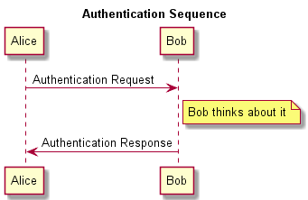

.. plantuml documentation master file, created by
   sphinx-quickstart on Fri May 17 16:20:50 2013.
   You can adapt this file completely to your liking, but it should at least
   contain the root `toctree` directive.

Welcome to plantuml's documentation!
====================================

.. include:: ../README.rst

Commandline Use
===============

**sample.txt**

.. literalinclude:: ../test/basic.txt

**commandline**

.. code:: console

    $ ls
    sample.txt
    $ python -m plantuml sample.txt 
    sample.txt: success.
    $ ls
    sample.png	sample.txt

**sample.png**

Library
===========

.. automodule:: plantuml
   :members:

License
===========

.. include:: ../LICENSE.txt

Indices and tables
==================

* :ref:`genindex`
* :ref:`search`

